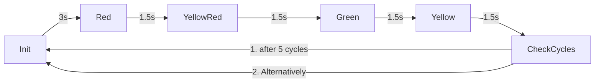

# Application Example Traffic Light 

## Description

This application example shows how to use the state framework of the package `@simatic-ax/statemachine`. In this example a simple traffic light will be realized.


## Execute the Application Example (AX Code local)
1. If not open, open a terminal (`CTRL+SHIFT+ö`)
1. Start a PLCSIM Advanced Instance (IP: Address 192.168.0.1)
1. Install dependencies
   
   ```cli
   apax install -L
   ```
1. Build in download the project to the PLC
   
   ```cli
   apax dlsim
   ```
   
   The project will be compiled and downloaded to the PLCSIM Advanced instance
   
1. Open the monitoring file mon.mon
1. Go online
 

## Contribution

Thanks for your interest in contributing. Anybody is free to report bugs, unclear documentation, and other problems regarding this repository in the Issues section or, even better, is free to propose any changes to this repository using Merge Requests.

## License and Legal information

Please read the [Legal information](LICENSE.md)