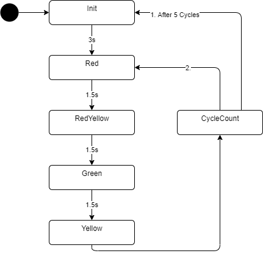

# Application Example Traffic Light

## Description

This application example shows how to use the state framework of the package `@simatic-ax/statemachine`. In this example a simple traffic light will be realized.



## Execute the Application Example (AX Code local)

1. Open a command line interface (CLI) and switch to the target folder like:

      ```sh
      D:
      cd \Git
      ```

1. Install the application example on your local PC

      Run the following commands in a CLI

      if you use apax `V1.2.0`

      ```sh
      apax create @simatic-ax/ae-trafficlight --registry https://npm.pkg.github.com ae-trafficlight
      ```

      if you use apax `V1.3.0`

      ```sh
      apax create @simatic-ax/template-ae-trafficlight --registry https://npm.pkg.github.com ae-trafficlight
      ```

      Open `AxCode` with

      ```sh
      axcode ae-trafficlight 
      ```

      and install the dependencies with:

      ```sh
      apax install -L
      ```

1. If not open, open a terminal (`CTRL+SHIFT+ö`)

1. Start a PLCSIM Advanced Instance (IP: Address 192.168.0.1). To change the IP you'll find information [here](#tips-and-tricks)

1. If not done, download a valid hardware configuration (FW >= 2.9 and IP address 192.168.0.1) to the PLCSIM Advanced Instance. The recommend way is using TIA Portal.

1. Install dependencies

   ```cli
   apax install -L
   ```

1. Build in download the project to the PLC

   ```cli
   apax dlsim
   ```

   The project will be compiled and downloaded to the PLCSIM Advanced instance

1. Open the monitoring file mon.mon

1. Go online

## Tips and tricks

### Change the IP address for the downloader

To change the target IP address, open the `apax.yml` and search the entry `IP_ADDRESS`, Enter the IP address for your target.

### Change the IP address for the online debugging and monitoring

To change the IP address for the debugging, open the file `./vscode/launch.json` and search the entry `ip`, Enter the IP address for your device.

## Contribution

Thanks for your interest in contributing. Anybody is free to report bugs, unclear documentation, and other problems regarding this repository in the Issues section or, even better, is free to propose any changes to this repository using Merge Requests.

## License and Legal information

Please read the [Legal information](LICENSE.md)
